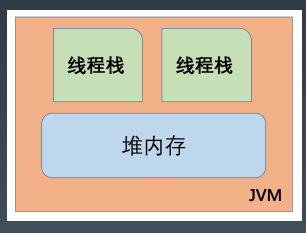
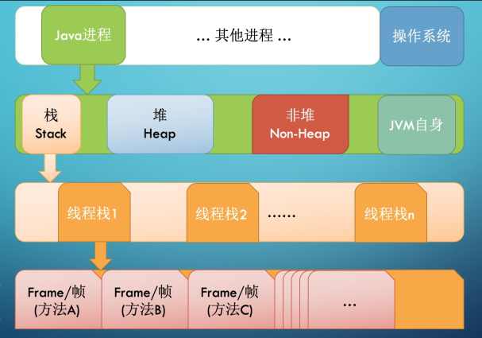
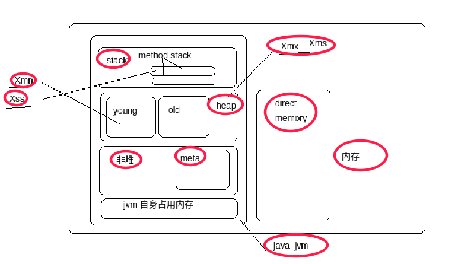

> 3、画一张图，展示 Xmx、Xms、Xmn、Meta、DirectMemory、Xss 这些内存参数的
  关系
  
  
  
# JVM 内存模型



- 线程独立的


**整体结构**:




  
```yaml

params:
  stack:
    Xss: # 线程方法栈空间大小
  heap:
    Xmx: # 最大堆大小
    Xms: # 初始堆大小
    Xmn: # 新生代堆大小 !! G1 不推荐设置此项, 官方推荐 最大堆的25%~50%
  meta: # 元空间,不属于堆,属于非堆(还是jvm管理)
  
  # 堆外内存,不属于jvm管理, 由os管理
  DirectMemory
```


