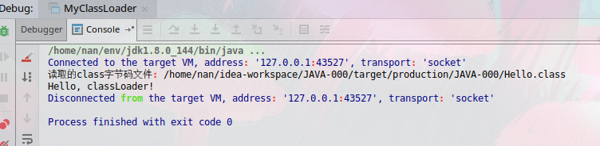
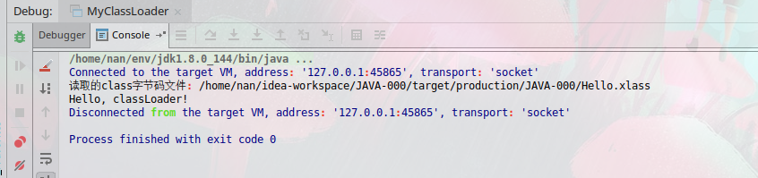

学习笔记

1 字节码

- [class - ByteCode](./1/Java%20字节码.md)


2 实现classLoader

```java
import java.io.*;

/**
 * TODO 1 extends ClassLoader Abstract class.
 */
public class MyClassLoader extends ClassLoader {

    private String seachpath, suffix = ".class";
    private boolean isDeal = false;

    public MyClassLoader(String contextPath) {
        super(null);

        seachpath = contextPath;
    }

    public MyClassLoader(String contextPath, String secretSuffix) {
        super(null);

        seachpath = contextPath;
        suffix = secretSuffix;
        isDeal = true;
    }

    public static void main(String[] args) throws Exception {

        // 指定一个根目录直接获取class文件
//        MyClassLoader loader = new MyClassLoader("target/production/JAVA-000/");

        // 处理加密的
        MyClassLoader loader = new MyClassLoader("target/production/JAVA-000/", ".xlass");

        Object hello = loader.findClass("Hello").newInstance();

        // 调用方法
        hello.getClass().getDeclaredMethod("hello").invoke(hello);

    }

    // TODO 2 Overide findClass method

    /**
     * Finds the class with the specified <a href="#name">binary name</a>.
     * This method should be overridden by class loader implementations that
     * follow the delegation model for loading classes, and will be invoked by
     * the {@link #loadClass <tt>loadClass</tt>} method after checking the
     * parent class loader for the requested class.  The default implementation
     * throws a <tt>ClassNotFoundException</tt>.
     *
     * @param name The <a href="#name">binary name</a> of the class
     * @return The resulting <tt>Class</tt> object
     * @throws ClassNotFoundException If the class could not be found
     * @since 1.2
     */
    @Override
    protected Class<?> findClass(String name) throws ClassNotFoundException {

        // 根据名字,找到class文件,并转换获得二进制的字节数组.

        name = name.replaceAll("\\.", "\\\\");
        final String fileName = seachpath + name + suffix;

        byte[] c = new byte[0];

        File file = new File(fileName);

        System.out.println("读取的class字节码文件: " + file.getAbsolutePath());

        try (FileInputStream fileInputStream = new FileInputStream(file);
             ByteArrayOutputStream bs = new ByteArrayOutputStream()
        ) {
            byte[] b = new byte[1024];

            int d = -1;
            while ((d = fileInputStream.read(b)) != -1) {
                bs.write(b, 0, d);
            }
            c = bs.toByteArray();
        } catch (FileNotFoundException e) {
            e.printStackTrace();
        } catch (IOException e) {
            e.printStackTrace();
        }

        if (isDeal) {
            for (int i = 0; i < c.length; i++) {
                c[i] = (byte)(255 - c[i]);
            }
        }

        return defineClass(name, c, 0, c.length);
    }
}
```


- 加载class

- 加载xlass



3 内存参数的关系

- [detail](./3/readme.md)
