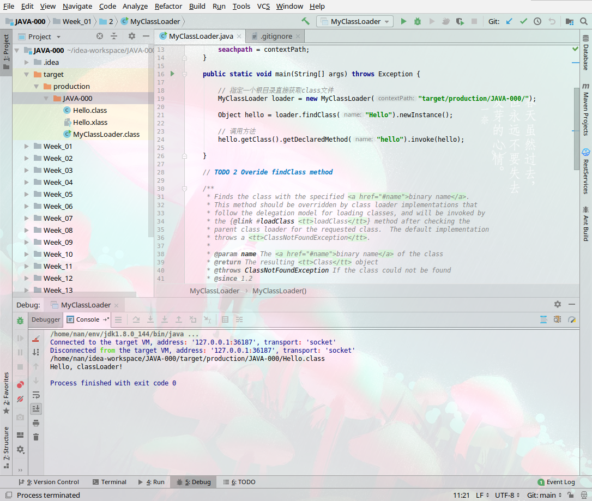

学习笔记

1 字节码

- [class - ByteCode](./1/Java%20字节码.md)


2 实现classLoader



```sh
/home/nan/env/jdk1.8.0_144/bin/java -agentlib:jdwp=transport=dt_socket,address=127.0.0.1:36187,suspend=y,server=n -javaagent:/home/nan/env/idea-IU-182.5262.2/lib/rt/debugger-agent.jar=file:/tmp/capture.props -Dfile.encoding=UTF-8 -classpath /home/nan/env/jdk1.8.0_144/jre/lib/charsets.jar:/home/nan/env/jdk1.8.0_144/jre/lib/deploy.jar:/home/nan/env/jdk1.8.0_144/jre/lib/ext/cldrdata.jar:/home/nan/env/jdk1.8.0_144/jre/lib/ext/dnsns.jar:/home/nan/env/jdk1.8.0_144/jre/lib/ext/jaccess.jar:/home/nan/env/jdk1.8.0_144/jre/lib/ext/jfxrt.jar:/home/nan/env/jdk1.8.0_144/jre/lib/ext/localedata.jar:/home/nan/env/jdk1.8.0_144/jre/lib/ext/nashorn.jar:/home/nan/env/jdk1.8.0_144/jre/lib/ext/sunec.jar:/home/nan/env/jdk1.8.0_144/jre/lib/ext/sunjce_provider.jar:/home/nan/env/jdk1.8.0_144/jre/lib/ext/sunpkcs11.jar:/home/nan/env/jdk1.8.0_144/jre/lib/ext/zipfs.jar:/home/nan/env/jdk1.8.0_144/jre/lib/javaws.jar:/home/nan/env/jdk1.8.0_144/jre/lib/jce.jar:/home/nan/env/jdk1.8.0_144/jre/lib/jfr.jar:/home/nan/env/jdk1.8.0_144/jre/lib/jfxswt.jar:/home/nan/env/jdk1.8.0_144/jre/lib/jsse.jar:/home/nan/env/jdk1.8.0_144/jre/lib/management-agent.jar:/home/nan/env/jdk1.8.0_144/jre/lib/plugin.jar:/home/nan/env/jdk1.8.0_144/jre/lib/resources.jar:/home/nan/env/jdk1.8.0_144/jre/lib/rt.jar:/home/nan/idea-workspace/JAVA-000/target/production/JAVA-000:/home/nan/env/idea-IU-182.5262.2/lib/idea_rt.jar MyClassLoader
Connected to the target VM, address: '127.0.0.1:36187', transport: 'socket'
Disconnected from the target VM, address: '127.0.0.1:36187', transport: 'socket'
/home/nan/idea-workspace/JAVA-000/target/production/JAVA-000/Hello.class
Hello, classLoader!

Process finished with exit code 0
```

3 内存参数的关系

- [detail](./3/readme.md)
