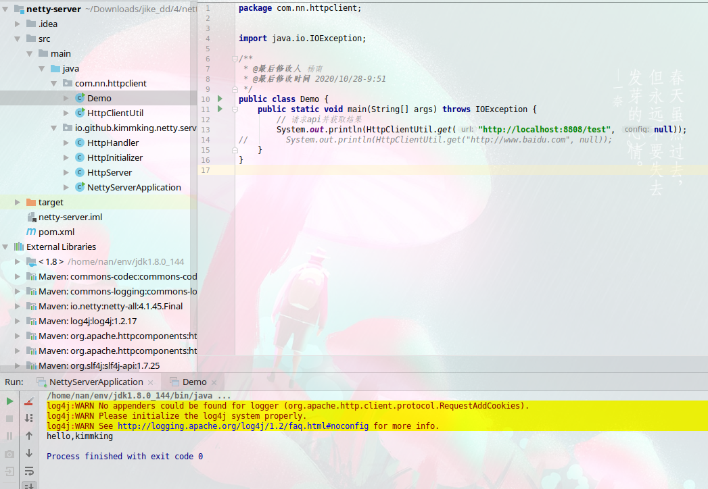

学习笔记

**测试环境说明**
- 8U 16R
- Linux 4.3.0-8 redhat
- jdk 1.8.0_144-b01


## Wrk 下载安装(Linux)

```text
# 拉源码
git clone https://github.com/wg/wrk.git  
cd wrk  
# 编译
make
```
编译成功后,会生成一个可以执行的wrk的可执行程序.就可以用来压测具体的程序了.
我偷个懒,就把wrk放在jdk的bin目录下面了就可以随便哪里都可以执行wrk命令了.

## GCLogAnalysis.java  课上最gc日志演示的例子。

**执行的命令**:
```sh
# serial128
java -Xmx128m -Xms128m -XX:+PrintGCDetails -XX:+PrintGCDateStamps  -XX:+UseSerialGC GCLogAnalysis
java -Xmx512m -Xms512m -XX:+PrintGCDetails -XX:+PrintGCDateStamps  -XX:+UseSerialGC GCLogAnalysis
java -Xmx128m -Xms128m -XX:+PrintGCDetails -XX:+PrintGCDateStamps  -XX:+UseSerialGC -Xloggc:gc.serial128m.log GCLogAnalysis
# parallel128
java -Xmx128m -Xms128m -XX:+PrintGCDetails -XX:+PrintGCDateStamps  -XX:+UseParallelGC GCLogAnalysis
java -Xmx512m -Xms512m -XX:+PrintGCDetails -XX:+PrintGCDateStamps  -XX:+UseParallelGC GCLogAnalysis
java -Xmx128m -Xms128m -XX:+PrintGCDetails -XX:+PrintGCDateStamps  -XX:+UseParallelGC -Xloggc:gc.parallel128m.log GCLogAnalysis
# cms128
java -Xmx128m -Xms128m -XX:+PrintGCDetails -XX:+PrintGCDateStamps  -XX:+UseConcMarkSweepGC GCLogAnalysis
java -Xmx512m -Xms512m -XX:+PrintGCDetails -XX:+PrintGCDateStamps  -XX:+UseConcMarkSweepGC GCLogAnalysis
java -Xmx128m -Xms128m -XX:+PrintGCDetails -XX:+PrintGCDateStamps  -XX:+UseConcMarkSweepGC -Xloggc:gc.cms128m.log GCLogAnalysis
# g1gc128
java -Xmx128m -Xms128m -XX:+PrintGCDetails -XX:+PrintGCDateStamps  -XX:+UseG1GC GCLogAnalysis
java -Xmx512m -Xms512m -XX:+PrintGCDetails -XX:+PrintGCDateStamps  -XX:+UseG1GC GCLogAnalysis
java -Xmx128m -Xms128m -XX:+PrintGCDetails -XX:+PrintGCDateStamps  -XX:+UseG1GC -Xloggc:gc.g1gc128m.log GCLogAnalysis
```
**备注:**
128M下,均发生了oom, 日志放在:`./k3/*.log`.


> gateway-server-0.0.1-SNAPSHOT.jar spring-boot例子，env.txt 压测工具，压测的时候分析jvm

```sh
# 并行 GC
java -jar -XX:+UseParallelGC -Xms512m -Xmx512m  gateway-server-0.0.1-SNAPSHOT.jar
java -jar -XX:+UseParallelGC -Xms2g -Xmx2g  gateway-server-0.0.1-SNAPSHOT.jar
# CMS GC
java -jar -XX:+UseConcMarkSweepGC -Xms512m -Xmx512m  gateway-server-0.0.1-SNAPSHOT.jar
java -jar -XX:+UseConcMarkSweepGC -Xms2g -Xmx2g  gateway-server-0.0.1-SNAPSHOT.jar
# G1 GC
java -jar -XX:+UseG1GC -Xms4g -Xmx4g  gateway-server-0.0.1-SNAPSHOT.jar
```
以512M 各种gc启动下的压测数据:

- parallel512

```sh
nan@nan:~/Downloads/jike_dd/4/netty-server$ wrk -t8 -c40 -d10s http://localhost:8088/api/hello
Running 10s test @ http://localhost:8088/api/hello
  8 threads and 40 connections
  Thread Stats   Avg      Stdev     Max   +/- Stdev
    Latency     1.72ms    2.67ms  39.83ms   89.50%
    Req/Sec     5.53k     1.09k   10.52k    72.88%
  440811 requests in 10.03s, 52.63MB read
Requests/sec:  43937.75
Transfer/sec:      5.25MB

```

- cms512

```sh
nan@nan:~/Downloads/jike_dd/4/netty-server$ wrk -t8 -c40 -d10s http://localhost:8088/api/hello
Running 10s test @ http://localhost:8088/api/hello
  8 threads and 40 connections
  Thread Stats   Avg      Stdev     Max   +/- Stdev
    Latency     1.31ms    1.80ms  25.13ms   87.64%
    Req/Sec     6.50k   781.86     9.57k    69.88%
  518250 requests in 10.03s, 61.87MB read
Requests/sec:  51658.84
Transfer/sec:      6.17MB

```

- g1gc 512

```sh
nan@nan:~/Downloads/jike_dd/4/netty-server$ wrk -t8 -c40 -d10s http://localhost:8088/api/hello
Running 10s test @ http://localhost:8088/api/hello
  8 threads and 40 connections
  Thread Stats   Avg      Stdev     Max   +/- Stdev
    Latency     1.38ms    2.23ms  31.36ms   90.23%
    Req/Sec     6.73k     0.93k    9.33k    67.00%
  537187 requests in 10.03s, 64.13MB read
Requests/sec:  53556.53
Transfer/sec:      6.39MB

```


## httpclient请求netty服务



```java
package com.nn.httpclient;

import org.apache.http.HttpEntity;
import org.apache.http.HttpResponse;
import org.apache.http.client.HttpClient;
import org.apache.http.client.config.RequestConfig;
import org.apache.http.client.methods.HttpGet;
import org.apache.http.client.methods.HttpPost;
import org.apache.http.impl.client.HttpClientBuilder;
import org.apache.http.util.EntityUtils;

import java.io.IOException;

/**
 * @最后修改人 杨南
 * @最后修改时间 2020/10/28-10:06
 */
public class HttpClientUtil {

    private static HttpClient client = HttpClientBuilder.create().build();

    private HttpClientUtil() {
    }

    public static HttpClient getClient() {
        return client;
    }

    public static String post(String url, HttpEntity reqEntity, RequestConfig config) throws IOException {
        HttpPost post = new HttpPost(url);
        post.setConfig(config);
        post.setEntity(reqEntity);
        HttpResponse response = client.execute(post);
        return responseMessage(response);
    }

    public static String get(String url, RequestConfig config) throws IOException {
        HttpGet get = new HttpGet(url);
        get.setConfig(config);
        HttpResponse response = client.execute(get);
        return responseMessage(response);
    }

    private static String responseMessage(HttpResponse response) throws IOException {
        if (response.getStatusLine().getStatusCode() == 200) {
            HttpEntity resEntity = response.getEntity();
            return EntityUtils.toString(resEntity, "utf-8");
        }
        return "Fail Request (500)";
    }

}


public class Demo {
    public static void main(String[] args) throws IOException {
        // 请求api并获取结果
        System.out.println(HttpClientUtil.get("http://localhost:8808/test", null));
//        System.out.println(HttpClientUtil.get("http://www.baidu.com", null));
    }
}
```


压测Netty服务数据:

```sh
nan@nan:~/Downloads/jike_dd/4/netty-server$ wrk -t8 -c40 -d60s http://localhost:8808/test
Running 1m test @ http://localhost:8808/test
  8 threads and 40 connections
  Thread Stats   Avg      Stdev     Max   +/- Stdev
    Latency   421.94us    2.09ms 155.47ms   97.61%
    Req/Sec    22.56k     6.19k   41.36k    76.87%
  10772957 requests in 1.00m, 1.09GB read
Requests/sec: 179414.39
Transfer/sec:     18.65MB
```
**基本测试数据:**
- qps = 179414.39
- 60s总请求数:10772957
- 8个线程
- 40个并发


No.1
```sh
# 此处是有20ms延时时压测数据:
nan@nan:~/Downloads/jike_dd/4/netty-server$ wrk -t8 -c100 -d20s http://localhost:8801/
Running 20s test @ http://localhost:8801/
  8 threads and 100 connections
  Thread Stats   Avg      Stdev     Max   +/- Stdev
    Latency     1.03s   143.91ms   1.89s    94.80%
    Req/Sec    13.25      9.57    40.00     66.86%
  907 requests in 20.02s, 76.04KB read
  Socket errors: connect 0, read 838, write 144, timeout 3
Requests/sec:     45.30
Transfer/sec:      3.80KB


# 此处是无20ms延时时压测数据:
nan@nan:~/Downloads/jike_dd/4/netty-server$ wrk -t8 -c40 -d60s http://localhost:8801/
Running 1m test @ http://localhost:8801/
  8 threads and 40 connections
  Thread Stats   Avg      Stdev     Max   +/- Stdev
    Latency     2.59ms    3.77ms  60.07ms   98.41%
    Req/Sec     2.07k   215.16     2.51k    90.17%
  990690 requests in 1.00m, 80.05MB read
  Socket errors: connect 0, read 844161, write 221228, timeout 0
Requests/sec:  16508.10
Transfer/sec:      1.33MB
```

No.2
```sh
# 此处是有20ms延时时压测数据:
nan@nan:~/Downloads/jike_dd/4/netty-server$ wrk -t8 -c40 -d60s http://localhost:8802/
Running 1m test @ http://localhost:8802/
  8 threads and 40 connections
  Thread Stats   Avg      Stdev     Max   +/- Stdev
    Latency    20.55ms  674.60us  33.62ms   91.90%
    Req/Sec   229.22     15.10   252.00     68.21%
  109583 requests in 1.00m, 8.77MB read
  Socket errors: connect 0, read 81285, write 35173, timeout 0
Requests/sec:   1825.35
Transfer/sec:    149.59KB
nan@nan:~/Downloads/jike_dd/4/netty-server$ 
# 此处是无20ms延时时压测数据:
nan@nan:~/Downloads/jike_dd/4/netty-server$ wrk -t8 -c100 -d20s http://localhost:8801/
Running 20s test @ http://localhost:8801/
  8 threads and 100 connections
  Thread Stats   Avg      Stdev     Max   +/- Stdev
    Latency    12.16ms   78.28ms   1.64s    97.93%
    Req/Sec     2.13k   765.94     4.58k    70.36%
  328543 requests in 20.01s, 26.44MB read
  Socket errors: connect 0, read 274301, write 77108, timeout 9
Requests/sec:  16422.94
Transfer/sec:      1.32MB
```

No.3
```sh
# 此处是有20ms延时时压测数据:

nan@nan:~/Downloads/jike_dd/4/netty-server$ wrk -t8 -c100 -d10s http://localhost:8803/
Running 10s test @ http://localhost:8803/
  8 threads and 100 connections
  Thread Stats   Avg      Stdev     Max   +/- Stdev
    Latency    48.30ms    8.99ms  63.22ms   62.33%
    Req/Sec   244.85     17.29   303.00     81.25%
  19513 requests in 10.01s, 1.51MB read
  Socket errors: connect 0, read 7346, write 12453, timeout 0
Requests/sec:   1949.38
Transfer/sec:    154.20KB

# 此处是无20ms延时时压测数据:
nan@nan:~/Downloads/jike_dd/4/netty-server$ wrk -t8 -c100 -d20s http://localhost:8803/
Running 20s test @ http://localhost:8803/
  8 threads and 100 connections
  Thread Stats   Avg      Stdev     Max   +/- Stdev
    Latency     8.14ms   65.34ms   1.04s    98.65%
    Req/Sec     5.93k     2.46k   13.13k    63.63%
  930356 requests in 20.06s, 71.97MB read
  Socket errors: connect 0, read 472960, write 473203, timeout 0
Requests/sec:  46372.68
Transfer/sec:      3.59MB

```

- 总结
    - 有延时和无延时,效率差的不是一点两点.
    - 在无延时时,测试发现cpu占用率100%,而在有延时的情况下,cpu占用率没有很大的增长,从平均请求时长就可以看出来,主要花在20ms延时上了.
    - 在测试几个不同的nio实现后,发现netty的效果最好,并发请求性能最好.
